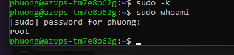

# Bài 2: User thường và đặc quyền quản trị (Sudoers Configuration)

> **Trạng thái: Đã kiểm tra sudo thành công với tài khoản phuong; phần SSH key và nhóm sudo chưa được xác minh.**
> Báo cáo dùng tài khoản hiện có `phuong` theo lựa chọn của học viên thay cho tên `devops` trong đề gốc. Không ghi nhận đã tạo user mới.

## 1. Thông tin

- Họ tên: **Bui Van Phuong**.
- GitHub: [hex2k6](https://github.com/hex2k6).
- Máy chủ: AZVPS, Ubuntu 22.04.5 LTS (đã xác minh ở bài 1).
- Tài khoản thực hành: `phuong`.
- AZVPS thay DigitalOcean theo xác nhận của học viên về sự cho phép của giảng viên.
- Khác biệt với đề gốc: sử dụng tài khoản `phuong` đã tồn tại thay vì tạo mới `devops`. Việc chấp nhận thay đổi tên và sử dụng tài khoản hiện có cần phù hợp với yêu cầu của giảng viên.

## 2. Mục tiêu

Làm việc bằng tài khoản thường và chỉ nâng quyền qua sudo khi cần. Kiểm tra quyền quản trị, nhóm sudo, cấu hình SSH và đăng nhập bằng khóa từ máy cá nhân.

## 3. Kết quả sudo đã có bằng chứng

Trong phiên tài khoản `phuong`, học viên chạy:

```sh
sudo -k
sudo whoami
```

- `sudo -k` yêu cầu xác thực lại ở lần sử dụng sudo tiếp theo.
- Terminal đã hỏi mật khẩu của `phuong`.
- Sau khi xác thực, `sudo whoami` trả về `root`.

Đoạn dưới đây được chép từ ảnh thực tế, không phải log chạy mới:

```text
phuong@azvps-tm7e8o62g:~$ sudo -k
phuong@azvps-tm7e8o62g:~$ sudo whoami
[sudo] password for phuong:
root
phuong@azvps-tm7e8o62g:~$
```



Ảnh không chứa mật khẩu. Kết quả xác nhận `phuong` được phép chạy lệnh này bằng sudo với quyền root; riêng kết quả này chưa chứng minh tài khoản thuộc nhóm sudo, có toàn bộ quyền quản trị hay đăng nhập SSH bằng key.

## 4. Tài khoản và nhóm sudo — cần bổ sung

`phuong` đã tồn tại và được sử dụng ở bài 1. Chưa có bằng chứng về lệnh tạo tài khoản hoặc lệnh thêm vào nhóm sudo; không ghi các lệnh này là đã thực hiện.

Bước kiểm tra tiếp theo trên VPS:

```sh
id phuong
```

Cần ảnh hoặc log có UID, GID và danh sách nhóm. Nếu tài khoản đã thuộc nhóm sudo, không cần thêm lại. Nếu chưa thuộc nhóm sudo, kiểm tra quy tắc cấp quyền hiện tại trước khi thay đổi. Việc `sudo whoami` thành công không xác định quyền được cấp qua nhóm nào.

## 5. SSH key và phân quyền — chưa hoàn thành

Bài 1 chưa hoàn tất tạo khóa trên Windows. Chưa có bằng chứng sao chép public key từ root, thiết lập quyền .ssh / authorized_keys hoặc đăng nhập bằng private key tương ứng.

Kiểm tra hiện trạng trước, không ghi đè cấu hình SSH của tài khoản đang sử dụng:

```sh
sudo test -s /root/.ssh/authorized_keys && echo "ROOT_KEY_PRESENT" || echo "ROOT_KEY_MISSING_OR_CHECK_FAILED"
sudo stat -c '%a %U:%G %n' /home/phuong/.ssh /home/phuong/.ssh/authorized_keys
```

Nếu đường dẫn chưa tồn tại, ghi nhận kết quả rồi thiết lập sau. Nếu có file authorized_keys, cần giữ lại các khóa đang dùng khi bổ sung khóa mới.

Yêu cầu cần đạt:

- Có cặp khóa được tạo trên máy Windows; private key được giữ trên máy cá nhân.
- Public key tương ứng được cấp phép theo quy trình bài tập, gồm bước sao chép từ root.
- Thư mục `/home/phuong/.ssh` có quyền 700.
- File `/home/phuong/.ssh/authorized_keys` có quyền 600.
- Chủ sở hữu là `phuong`, nhóm phù hợp với tài khoản sau khi kiểm tra `id phuong`.
- Không sao chép private key của root, không đưa mật khẩu/private key lên GitHub.

Do phiên hiện tại là `phuong`, `~/.ssh` là thư mục của phuong, không phải của root. Khi cần lấy authorized_keys của root phải dùng đường dẫn tuyệt đối `/root/.ssh/authorized_keys`.

## 6. Kiểm tra SSH cuối cùng — chưa thực hiện

Sau khi cài public key thành công, chạy trong PowerShell **trên Windows**, với đường dẫn private key đúng:

```powershell
ssh -o PreferredAuthentications=publickey -o PasswordAuthentication=no -o KbdInteractiveAuthentication=no -i "$env:USERPROFILE\.ssh\azvps_ed25519" phuong@<IP_VPS>
```

Thay `<IP_VPS>` bằng IP thực tế. Chỉ dùng đường dẫn trên nếu đã tạo khóa ở vị trí đó. Các tùy chọn buộc thử xác thực public key, không chuyển sang mật khẩu máy chủ. Passphrase của private key, nếu có, vẫn có thể được yêu cầu.

Trong phiên mới, chạy:

```sh
whoami
id
sudo -k
sudo whoami
```

Kết quả cần có: đăng nhập bằng key thành công, `whoami` trả về `phuong`, nhóm sudo được xác minh và `sudo whoami` trả về `root`. Giữ phiên quản trị hiện tại mở cho đến khi kiểm tra xong.

## 7. Đối chiếu trước khi nộp

- [x] Có tài khoản thường đang sử dụng: phuong (bằng chứng ở bài 1).
- [x] Kiểm tra sudo yêu cầu mật khẩu và trả về root, có ảnh thực tế.
- [ ] Xác minh phuong thuộc nhóm sudo qua id phuong.
- [ ] Bổ sung bằng chứng tạo user nếu giảng viên vẫn yêu cầu tạo mới.
- [ ] Xác minh cặp SSH key và public key của root.
- [ ] Sao chép/cài public key cho phuong, giữ các khóa đã có.
- [ ] Kiểm tra quyền và chủ sở hữu .ssh / authorized_keys.
- [ ] Đăng nhập SSH bằng khóa từ Windows thành công.
- [ ] Hoàn tất các yêu cầu còn thiếu và xác nhận ngoại lệ tên tài khoản khi nộp.

Đường dẫn bài: [homework/session_02/ex2/](https://github.com/hex2k6/IT209_SS2_02/tree/main/homework/session_02/ex2).
